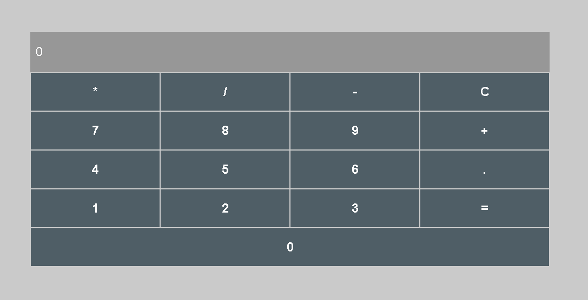

# Calculadora simples

- Este é o primeiro projeto do desafio da trilha de react do Bootcamp da DIO.
- Nele, tive como tarefa fazer as funcionalidades básicas de uma calculadora com react.

<h1 align="center">
 
</h1>
